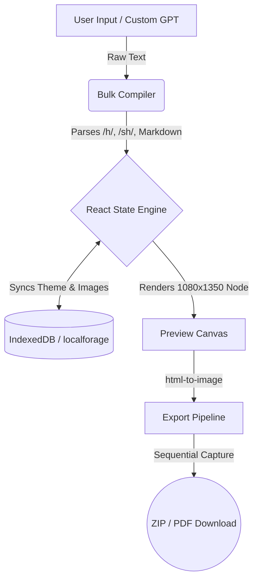

# Carousel Architect ⚡️

A lightning-fast, 100% local, browser-based carousel generator for creators.

No servers. No databases. No paywalls. No API keys. Just type, format, and export.
**Live App:** [https://mycarouselcreator.vercel.app/](https://mycarouselcreator.vercel.app/)

## Why this exists

Design tools like Canva are too slow for simple text carousels. They force you to drag boxes and fight with layers. Carousel Architect is built to kill procrastination. You dump your raw text in, and it instantly spits out a pixel-perfect, high-res PDF or ZIP.

## The Architecture (How it works without a backend)

Everything happens locally in your browser.



## Tech Stack

**Frontend:** React 19, Vite, Tailwind CSS 4.0

**Storage:** localforage (IndexedDB) for massive image/project storage without hitting 5MB limits.

**Export:** html-to-image, jsPDF, JSZip (Sequential rendering to prevent mobile RAM crashes).

**Compression:** Built-in HTML5 Canvas compression for all image uploads.

## Running Locally

```bash
git clone https://github.com/Shezan-op/Carousel-Creator.git
cd Carousel-Creator
npm install
npm run dev
```

**Built by Shezan Ahmed**
