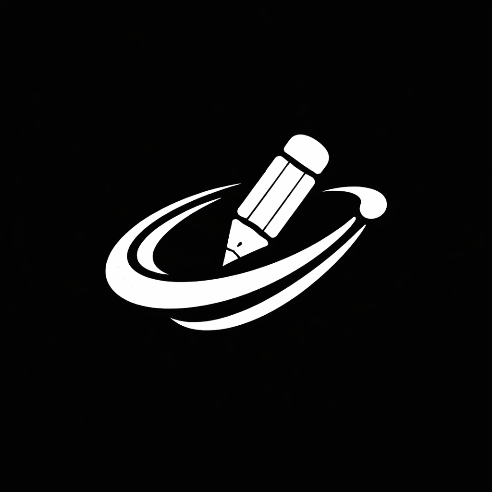

<p align="center">
  
</p>

<h1 align="center">Carousel Creator</h1>

<p align="center">
  <strong>Transform raw text into viral social media carousels in seconds.</strong><br/>
  100% serverless. Privacy-first. Built for modern creators.
</p>

<p align="center">
  <a href="https://carousel-creator-kohl.vercel.app/" target="_blank">🚀 Live Demo</a> &nbsp;·&nbsp;
  <a href="./HOW_TO_USE.md">📖 How to Use</a> &nbsp;·&nbsp;
  <a href="./WALKTHROUGH.md">🎯 60-Second Walkthrough</a>
</p>

---

## What is Carousel Creator?

Carousel Creator is a **high-performance, browser-based design tool** that converts raw text into pixel-perfect LinkedIn and Instagram carousels — no Canva, no Figma, no design skills required.

It was built from the ground up as a **React 19 + TypeScript** single-page application with a custom **Bulk Compiler**, a **Triple-Layer Markdown Engine**, and a **Multi-Template Export Pipeline** that generates print-ready assets in one click.

---

## ✨ Feature Highlights

### 🎨 Three Professional Templates

| Minimal | Faux Tweet | Brutalist |
|---------|-----------|-----------|
| Clean, modern typography with accent highlights | Simulates a viral X/Twitter post with engagement metrics | Heavy uppercase type with high-contrast block accents |

### ⚡ The Bulk Compiler

Write naturally, get structured slides. The compiler uses a tag-based syntax:

```
/h/ Your Headline Here
/sh/ A subtitle or section header
Body text flows naturally without any tags.

/h/ Slide 2 Title
More body content for slide 2.
```

Double-enter creates a new slide. Per-slide overrides are inline: `/h, s:120, a:center/ Big Title`.

### 🖋 Multi-Font Markdown Engine

- `*highlight*` → Template-aware accent (color in Minimal, block in Brutalist, link-blue in Tweet)
- `**bold**` → Extra-heavy weight
- `_italic_` → Italic emphasis
- `__underline__` → Clean CSS-based underline
- **Character Foundry**: Independently select any Google Font for **Headlines**, **Subheadings**, and **Body text**. Optimized deduped injection ensures fast loading.

### 📱 Focus Modal (Mobile Editor)

A Figma-inspired mobile workspace that allows for per-slide precision tuning:

- **Numerical Sizing**: Type exact pixel values for every primary text element.
- **Segmented Alignment**: Toggle Horizontal alignment (Left/Center/Right) instantly.
- **Vertical Drafting**: Micro-tune the Y-axis position with 10px increments.
- **Live Font Preview**: Type the name of any Google Font and see it render instantly in the focus preview.

### 🔒 Privacy-First & BYOK Architecture

- **Zero backend** — all processing happens in your browser
- **Bring Your Own Key (BYOK)** — your OpenRouter API key is stored locally, never transmitted to us
- **Local persistence** — creator identity, preferences, and content saved to `localStorage`

### 📱 Responsive Design

- **Desktop**: Professional split-pane workspace with zoom controls
- **Mobile**: Natural document flow with dynamic `transform: scale()` canvas fitting

---

## 🏗 Architecture & Tech Stack

| Layer | Technology | Purpose |
|-------|-----------|---------|
| **Framework** | React 19 + TypeScript | Type-safe component architecture |
| **Build** | Vite 7 | Sub-second HMR, optimized production bundles |
| **Styling** | Tailwind CSS 4.0 | Utility-first responsive design |
| **Export: PDF** | `html-to-image` + `jsPDF` | DOM-to-JPEG capture → multi-page PDF |
| **Export: ZIP** | `html-to-image` + `JSZip` + `file-saver` | Multi-template batch render → ZIP archive |
| **AI** | OpenRouter API | Optional text-to-carousel generation (BYOK) |
| **Analytics** | Vercel Analytics + Speed Insights | Production performance monitoring |
| **Icons** | Lucide React | Consistent, tree-shakeable icon system |
| **Hosting** | Vercel | Edge deployment with automatic CI/CD |

### Key Engineering Decisions

- **Rigid Canvas (1080×1350)**: All slides render at a fixed 4:5 aspect ratio inside a `transform: scale()` wrapper. The DOM node is always 1080×1350px — scaling is purely visual. This guarantees pixel-perfect exports regardless of viewport size.
- **Safe Zone Padding**: 108px padding on all sides constrains text to an 864×1134px safe zone, preventing content from being cropped on any platform.
- **Unified Typography Model**: A single `subheading_size` property controls both H2 (subheadline) and H3 (section header) elements across all templates, with backwards-compatible support for the deprecated `subheadline_size` field.
- **Multi-Font Orchestrator**: Uses a custom logic to merge multiple font requests into a single Google Fonts API call with full weight support (400-900 + italics), minimizing layout shift.
- **Nested Markdown Parser**: A sequential HTML injector that allows for complex formatting combinations (e.g., ****bold + italic + underline****).
- **Defensive Storage**: All `localStorage` operations are wrapped in try/catch to handle quota limits gracefully. Counter parsers guard against `NaN` pollution.

---

## 🚀 Getting Started

### Prerequisites

- Node.js 18+ and npm

### Local Development

```bash
git clone https://github.com/Shezan-op/Carousel-Creator.git
cd Carousel-Creator
npm install
npm run dev
```

The app will be available at `http://localhost:5173`.

### Production Build

```bash
npm run build    # TypeScript check + Vite production bundle
npm run preview  # Preview the production build locally
```

### Deploy to Vercel

```bash
# Option 1: CLI
npx vercel --prod

# Option 2: Git-based (recommended)
# Push to main → Vercel auto-deploys
git push origin main
```

### Environment Variables (Optional)

| Variable | Purpose |
|----------|---------|
| `VITE_GOOGLE_SCRIPT_URL` | Google Apps Script endpoint for lead capture |

---

## 📁 Project Structure

```
src/
├── App.tsx                    # Root shell, global state, layout
├── main.tsx                   # React DOM entry point
├── types.ts                   # TypeScript interfaces (Slide, Theme, CarouselData)
├── index.css                  # Global styles, Tailwind imports, custom scrollbar
├── components/
│   ├── LeftPane.tsx            # Bulk compiler, AI generator, tuner controls, setup
│   ├── CarouselPreview.tsx     # Multi-template slide renderer, export nodes
│   ├── ExportControls.tsx      # PDF/ZIP export engine, lead capture modal
│   └── NetflixIntro.tsx        # Animated splash screen
public/
├── Logo.png                   # App logo
├── manifest.json              # PWA manifest
└── *.pdf                      # Sample exported carousels
```

---

## 🧪 Bulk Compiler Syntax Reference

| Syntax | Effect | Example |
|--------|--------|---------|
| `/h/ text` | Headline (H1) | `/h/ Why AI Matters` |
| `/sh/ text` | Subheadline (H2) or Section Header (H3) | `/sh/ The 5 Key Trends` |
| Plain text | Body paragraph | `AI is transforming every industry.` |
| `/h, s:120/` | Headline with custom size | `/h, s:120/ BIG TITLE` |
| `/sh, sh_s:60/` | Subhead with custom size | `/sh, sh_s:60/ Sized Subtitle` |
| `, a:center` | Text alignment override | `/h, a:center/ Centered` |
| `, y:50` | Y-offset (vertical shift) | `/h, y:50/ Shifted Down` |
| `*text*` | Highlight accent | `This is *important*` |
| `**text**` | Bold | `This is **critical**` |
| `_text_` | Italic | `This is _emphasized_` |
| `__text__` | Underline | `This is __underlined__` |
| Double newline | New slide | *(blank line between blocks)* |

---

## 🔐 Security Model

- **Lead Capture**: `localStorage.setItem('carousel_unlocked', 'true')` is strictly inside the `try` block after a successful API call. Network failures refuse the unlock token.
- **Rate Limiting**: 30-second cooldown between email submissions (client-side).
- **Input Sanitization**: Text inputs capped at 10,000 characters to prevent ReDoS. Slide count capped at 50.
- **API Key Handling**: OpenRouter key stored as a password input, persisted only to local `localStorage`.
- **CORS Safety**: All images (avatar, background) are converted to base64 data URLs on ingestion, preventing tainted canvas errors during export.

---

## 📈 SEO & Discovery

`LinkedIn Carousel Generator` · `Instagram Carousel Maker` · `Free AI Carousel Tool` · `Open Source Content Creation` · `1080x1350 Social Media Design` · `React Carousel Export` · `Bulk Text to Carousel` · `Professional Slide Generator`

---

## 📄 License

MIT — free for personal and commercial use.

---

<p align="center">
  Built with 🧠 by <a href="https://www.linkedin.com/in/shezanahmed29/" target="_blank"><strong>Shezan Ahmed</strong></a> · Founder @ <a href="https://www.linkedin.com/company/lead-linked/" target="_blank">LeadLinked</a>
</p>
