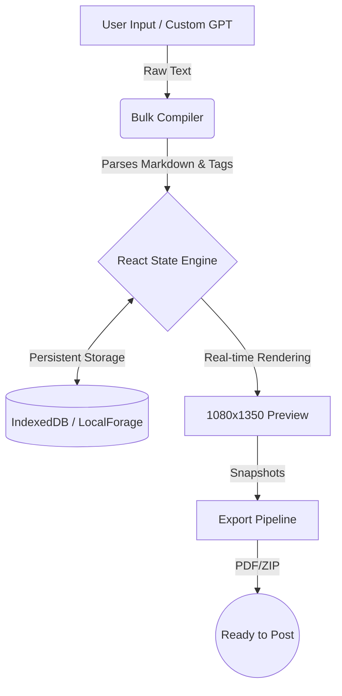

# Carousel Architect ⚡️

### Stop fighting Canva. Start creating carousels

A lighting-fast, **100% free**, and **local-first** creator tool. Built to turn your raw ideas into high-converting LinkedIn and Instagram carousels in seconds.

**[Try the Live App 🚀](https://mycarouselcreator.vercel.app/)**

---

## 😤 The Problem

Most design tools are "drag-and-drop" nightmares for text-heavy content. You spend 40 minutes fighting with layers, alignment, and "box-dragging" just to share a simple 5-slide list.

**Procrastination wins when the barrier to creation is high.**

## ✅ The Solution: Carousel Architect

Architect is a **Bulk Compiler**. You don't drag boxes; you just type.

1. **Type your text** using simple tags like `/h/` for headlines.
2. **Watch the magic** as it auto-renders pixel-perfect slides in real-time.
3. **Download one file** (PDF or ZIP) and you're done.

---

## 🌟 Key Features (Solo-Developer Built)

- **⚡️ Blazing Fast:** No splash screens. No "Loading project..." Spinners. Just open and type.
- **🔒 100% Private (Local-First):** Your data, images, and brand presets never leave your computer. Everything stays in your browser's private storage.
- **🛠️ Bulk Text Compiler:** Turn a raw text dump into a 10-slide carousel in 30 seconds.
- **🎭 Multi-Template Preview:** See how your content looks in **Minimal**, **Tweet**, or **Brutalist** styles instantly.
- **📦 Content Pack Engine:** Exporting as a ZIP automatically gives you your carousel in *all* styles so you can A/B test what performs best.
- **📱 PWA Enabled:** Install it on your desktop or phone for a native app experience.

---

## 🏗️ The Architecture

We replaced the complex backend with a browser-native stack. It's faster for you and cheaper for us.



---

## 📖 Quick Start for Non-Techies

Don't let "Architecture" scare you. Here is the only thing you need to know to use this today:

```markdown
/h/ My Big Idea
/sh/ Why it matters to you.

This is the body text for Slide 1.
(A blank line starts a new slide!)

/h/ Slide 2 Headline
This is the body for Slide 2.
```

1. **Paste** that into the editor.
2. **Pick a color** you like.
3. **Hit Download.**

---

## 🤝 Open Source & Community

Carousel Architect is open-source. No hidden paywalls, no "Premium" exports, no watermarks you can't remove.

**Built with ❤️ for creators who just want to share their voice.**
